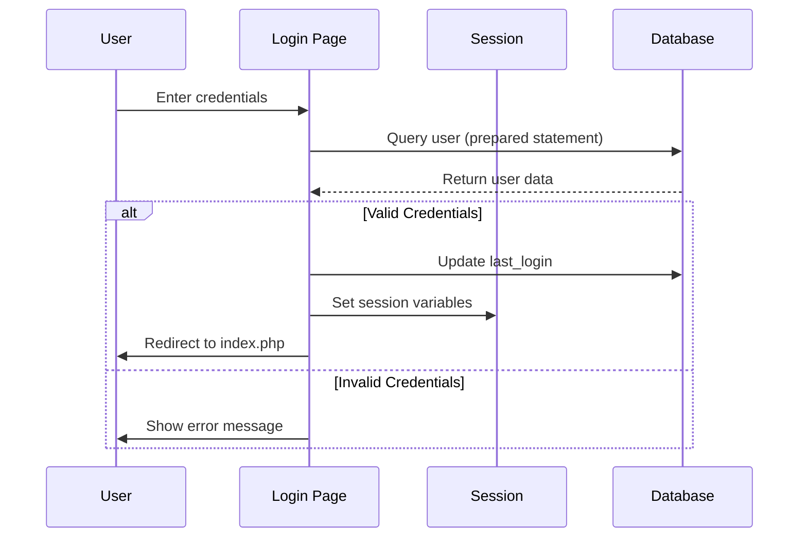

# Authentication System Implementation

## Overview
The system implements a role-based authentication system with session management and secure password handling.

## Components

### 1. Database Schema (admins table)
```sql
CREATE TABLE admins (
    id INT AUTO_INCREMENT PRIMARY KEY,
    username VARCHAR(50) NOT NULL UNIQUE,
    password VARCHAR(255) NOT NULL,
    email VARCHAR(100),
    full_name VARCHAR(100),
    role ENUM('admin', 'editor', 'viewer') DEFAULT 'viewer',
    is_active BOOLEAN DEFAULT TRUE,
    last_login DATETIME,
    created_at TIMESTAMP DEFAULT CURRENT_TIMESTAMP
)
```

#### Key Features:
- Role-based access control (admin, editor, viewer)
- Account activation status tracking
- Login activity monitoring
- Unique username constraint
- Password hashing (BCrypt)

### 2. Authentication Flow (login.php)

#### Session Management
- PHP session handling with `session_start()`
- Session variables stored:
  - user_id
  - username
  - role

#### Security Measures
1. Password Security
   - BCrypt password hashing
   - Password verification using `password_verify()`
   - Secure password storage

2. Access Control
   - Role-based authorization
   - Active account verification
   - Session-based authentication

3. SQL Injection Prevention
   - Prepared statements
   - PDO for database operations
   - Parameter binding

4. Error Handling
   - Generic error messages (no information leakage)
   - Graceful failure handling
   - User-friendly error display

### 3. User Interface (login.css)
- Clean, modern design
- Bootstrap integration
- Responsive layout
- Clear visual feedback
- Consistent branding (blue theme)

## Authentication Process Flow


## Security Considerations

### Implemented
1. Password Security
   - BCrypt hashing
   - Secure storage
   - No plain text passwords

2. Session Security
   - Server-side session storage
   - Session variables for authentication
   - Automatic session cleanup

3. Database Security
   - Prepared statements
   - Parameter binding
   - Connection security

### Recommendations
1. Additional Security Measures
   - Implement CSRF protection
   - Add rate limiting
   - Enable secure cookie flags
   - Add 2FA support

2. Session Enhancement
   - Implement remember-me functionality
   - Add session timeout
   - Track concurrent sessions

3. Password Policy
   - Implement password complexity rules
   - Add password expiration
   - Implement account lockout

## Integration Points

### Database Integration
- Uses central database connection (db.php)
- Leverages prepared statements
- Handles connection errors

### UI Integration
- Bootstrap 5.3.0
- Bootstrap Icons 1.11.1
- Custom styling (login.css)

### Error Handling
- User-friendly error messages
- Secure error handling
- No sensitive information exposure

## Dependencies
1. Helper Modules
   - env.php: Environment configuration
   - db.php: Database connection

2. External Libraries
   - Bootstrap CSS (5.3.0)
   - Bootstrap Icons (1.11.1)
   - Bootstrap JS Bundle