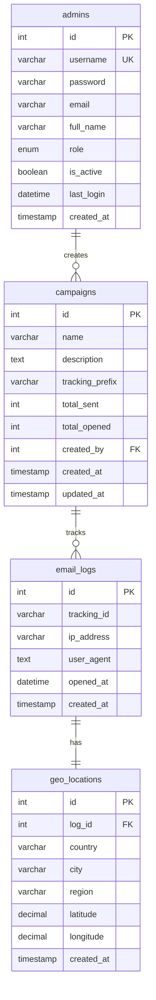

# Database Implementation

## Schema Overview

The database uses MySQL with InnoDB engine and UTF-8MB4 character set, consisting of four main tables:

### Tables Relationship Diagram


## Table Structures

### 1. Admins Table
```sql
CREATE TABLE admins (
    id INT AUTO_INCREMENT PRIMARY KEY,
    username VARCHAR(50) NOT NULL UNIQUE,
    password VARCHAR(255) NOT NULL,
    email VARCHAR(100),
    full_name VARCHAR(100),
    role ENUM('admin', 'editor', 'viewer') DEFAULT 'viewer',
    is_active BOOLEAN DEFAULT TRUE,
    last_login DATETIME,
    created_at TIMESTAMP DEFAULT CURRENT_TIMESTAMP
)
```

Purpose:
- User management and authentication
- Role-based access control
- Activity tracking

Key Features:
- Unique usernames
- BCrypt password storage (255 chars)
- Role-based permissions
- Account status tracking
- Login activity monitoring

### 2. Campaigns Table
```sql
CREATE TABLE campaigns (
    id INT AUTO_INCREMENT PRIMARY KEY,
    name VARCHAR(100) NOT NULL,
    description TEXT,
    tracking_prefix VARCHAR(32) NOT NULL,
    total_sent INT DEFAULT 0,
    total_opened INT DEFAULT 0,
    created_by INT,
    created_at TIMESTAMP DEFAULT CURRENT_TIMESTAMP,
    updated_at TIMESTAMP DEFAULT CURRENT_TIMESTAMP ON UPDATE CURRENT_TIMESTAMP,
    FOREIGN KEY (created_by) REFERENCES admins(id)
)
```

Purpose:
- Email campaign management
- Track campaign statistics
- Link campaigns to creators

Key Features:
- Campaign metadata storage
- Automatic statistics counting
- Creator tracking
- Timestamp maintenance
- Unique tracking prefix

### 3. Email Logs Table
```sql
CREATE TABLE email_logs (
    id INT AUTO_INCREMENT PRIMARY KEY,
    tracking_id VARCHAR(32) NOT NULL,
    ip_address VARCHAR(45) NOT NULL,
    user_agent TEXT,
    opened_at DATETIME NOT NULL,
    created_at TIMESTAMP DEFAULT CURRENT_TIMESTAMP
)
```

Purpose:
- Track email opens
- Store tracking metadata
- Record user information

Key Features:
- Unique tracking IDs
- IPv6 support (45 chars)
- User agent storage
- Precise timestamp tracking

### 4. Geo Locations Table
```sql
CREATE TABLE geo_locations (
    id INT AUTO_INCREMENT PRIMARY KEY,
    log_id INT NOT NULL,
    country VARCHAR(100),
    city VARCHAR(100),
    region VARCHAR(100),
    latitude DECIMAL(10, 8),
    longitude DECIMAL(11, 8),
    created_at TIMESTAMP DEFAULT CURRENT_TIMESTAMP,
    FOREIGN KEY (log_id) REFERENCES email_logs(id)
)
```

Purpose:
- Store geographic data
- Link location to email opens
- Enable location analytics

Key Features:
- High-precision coordinates
- Hierarchical location data
- One-to-one relationship with logs

## Design Patterns

### 1. Timestamp Pattern
- All tables include created_at
- Campaigns include updated_at
- Automatic timestamp maintenance
- Consistent datetime tracking

### 2. Soft Delete Pattern
- is_active flag in admins
- No physical record deletion
- Maintains data integrity
- Allows account restoration

### 3. Foreign Key Pattern
- Maintains referential integrity
- Cascading relationships
- Clear data ownership
- Prevents orphaned records

### 4. Counter Cache Pattern
- Campaign table stores counts
- total_sent and total_opened
- Reduces query complexity
- Improves performance

## Data Relationships

1. Campaigns to Admins (Many-to-One)
   - Each campaign has one creator
   - Admins can create multiple campaigns
   - Foreign key on created_by

2. Email Logs to Geo Locations (One-to-One)
   - Each log has one location
   - Direct relationship through log_id
   - Separates location data

3. Campaigns to Email Logs (One-to-Many)
   - Campaigns track multiple emails
   - Linked through tracking_prefix
   - Enables campaign analytics

## Indexing Strategy

1. Primary Keys
   - Auto-incrementing integers
   - Consistent across tables
   - Optimal for joins

2. Foreign Keys
   - Indexed automatically
   - Optimizes relationship queries
   - Maintains referential integrity

3. Unique Constraints
   - Username in admins
   - Ensures data consistency
   - Prevents duplicates

## Recommendations

1. Performance Optimization
   - Add index on tracking_id
   - Add index on ip_address
   - Consider partitioning for logs
   - Archive old data strategy

2. Data Integrity
   - Add NOT NULL constraints
   - Validate tracking_prefix format
   - Add CHECK constraints
   - Implement triggers for counters

3. Scalability
   - Plan for log table growth
   - Consider table partitioning
   - Implement archiving strategy
   - Monitor index performance