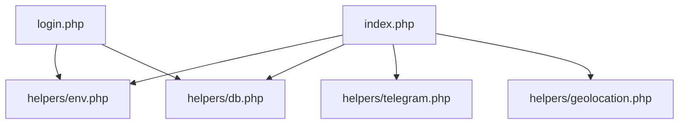

# System Patterns

## Architectural Overview
The system follows a modular architecture with clear separation of concerns:

## Component Organization
```
root/
├── helpers/         # Utility modules
│   ├── db.php      # Database operations
│   ├── env.php     # Environment configuration
│   ├── geolocation.php  # Location services
│   └── telegram.php     # Telegram integration
├── public/         
│   ├── index.php   # Main application entry
│   └── login.php   # Authentication handler
└── assets/
    ├── index.css   # Main styles
    └── login.css   # Authentication styles
```

## Design Patterns

### 1. Module Pattern
- Helper functions are organized into specific-purpose modules
- Each module handles a distinct responsibility
- Clear separation of concerns between modules

### 2. Configuration Management
- Environment-based configuration (.env.example)
- Centralized environment handling (env.php)
- Separation of configuration from code

### 3. Authentication Flow
- Dedicated login system (login.php)
- Separate styling for authentication (login.css)
- Session-based user management

### 4. External Service Integration
- Modular integration with Telegram
- Geolocation services abstraction
- Database connection management

## Code Organization Principles
1. **Separation of Concerns**
   - Each helper module has a specific responsibility
   - UI components are separated from business logic

2. **Configuration Management**
   - Environment variables for configuration
   - Template-based configuration setup

3. **Resource Organization**
   - CSS files paired with their respective PHP files
   - Helper modules grouped in dedicated directory

4. **Security Considerations**
   - .htaccess for Apache configuration
   - Environment variable protection
   - Separate login system

## Integration Patterns
1. **Database Integration**
   - Centralized database connection management
   - SQL setup script for database initialization

2. **External Services**
   - Telegram API integration module
   - Geolocation services module

3. **Frontend Integration**
   - Dedicated CSS files for different sections
   - Static asset management

## System Relationships


This diagram shows the basic dependency relationships between core components.